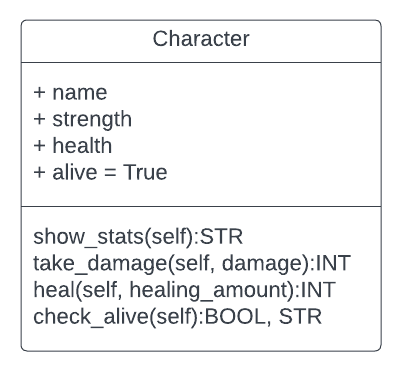
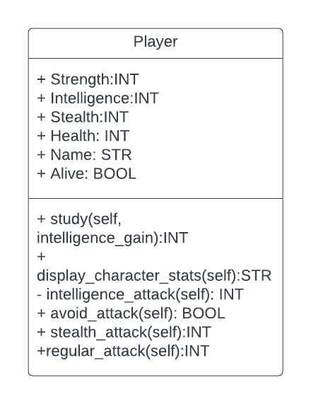
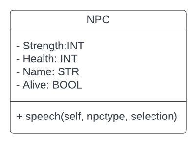
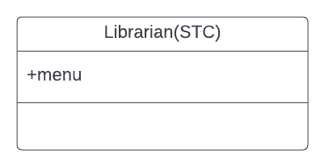
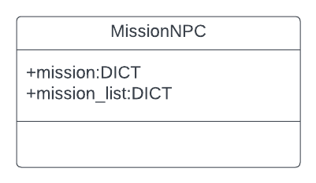
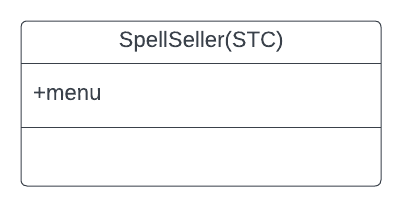
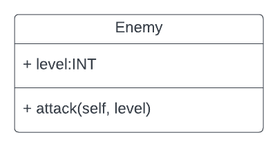
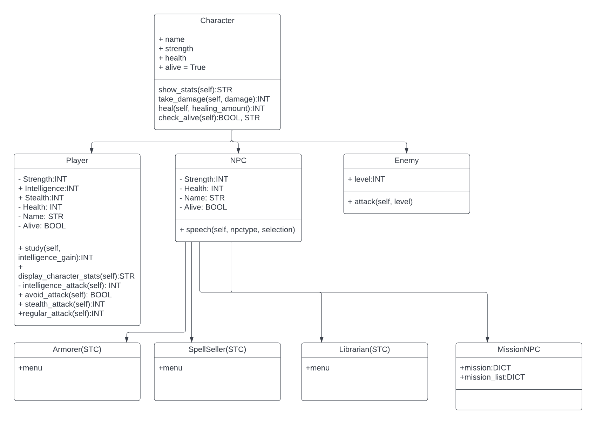

# Diagrams
___
## Character UML
___

## Player UML
___

## NPC UML
___

## Librarian UML
___

## Armorer UML
___

## MissionNPC UML
___

## SpellSeller UML (This will be renamed once I figure out what the special will be)
___

## Enemy UML
___

## Current Inheritance
___
